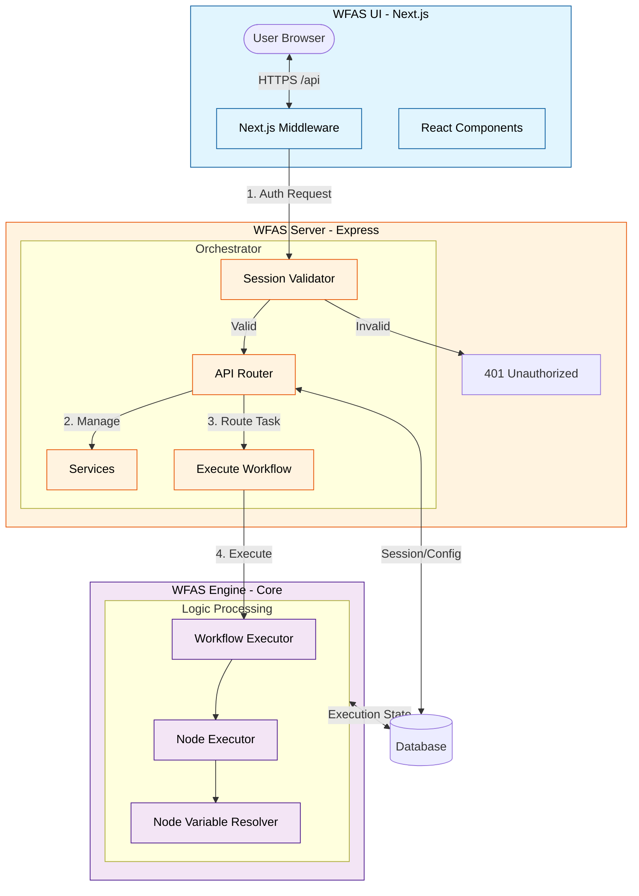

<div align="center">

[](https://github.com/soamn/wfas-ui)
[](https://github.com/soamn/wfas-server)
[](https://github.com/soamn/wfas-engine)


# WFAS Engine

### The Unified Workflow Automation System

**WFAS** is a high-performance, node-based automation engine. This repository serves as the **Main Container**, orchestrating the Frontend (UI), Backend (Server) and Backend (engine) via Git Submodules.

</div>

---

## ⚙️ Overview

### Execution Flow Architecture



---

## Local Setup

Run Setup locally by this single source Rather than individual Setup

- note: similar env variable must have same values

```
git clone --recursive https://github.com/soamn/wfas
cd wfas
```

```
cd wfas-engine
cp .env.example .env
pnpm install
pnpm run prisma:generate
pnpm run build
pnpm run start

```

```
cd wfas-server
cp .env.example .env
docker build -t wfas-server .
docker run --network="host" --env-file .env wfas-server

```

```
cd wfas-server
cp .env.example .env
docker build -t wfas-server .
docker run --network="host" --env-file .env wfas-server

```

```
cd wfas-ui
cp .env.example .env
pnpm install
pnpm run build
pnpm run start
```

📄 License

This project is licensed under the GNU General Public License v3.0.
